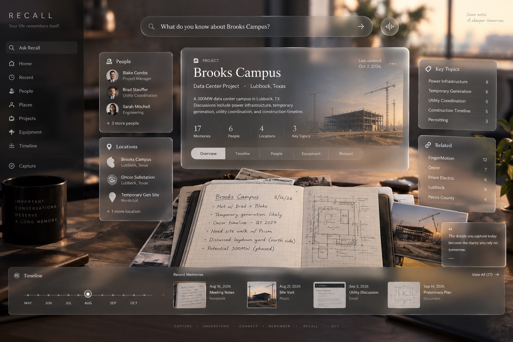

# Recall — Canonical Experience & Visual System

> **CURRENT PRODUCT CENTER — 2026-10-10.** The [pilot amendment](PILOT-CONTRACT.md) governs this document wherever older text conflicts. The desktop Memory Surface is the primary shell. The phone is the capture/ask companion. No login or email-auth UX. PR #16 remains an optional web companion and enrollment transport. The 2026-10-09 PWA-only pilot note is historical.


Version: 1.1 | Date: 2026-10-10 | Status: **approved canonical product direction, with the owner visual reference as desktop authority**

This document defines the target Recall experience. It supersedes conventional dashboard/page-navigation interpretations of the earlier UX baseline while preserving Recall's trust, provenance, accessibility, and universal-memory requirements.

The desktop composition target is the owner-supplied reference below. Prose in this file remains authority for materials, trust, capture, and interaction grammar. Where the 2026-10-07 prose and the reference differ on desktop layout, the reference wins. Those differences are called out in the reference section.

## Owner visual reference (2026-10-10)



File: [docs/assets/memory-surface-reference-2026-10-10.jpg](assets/memory-surface-reference-2026-10-10.jpg). Credit: owner-supplied reference, Nick Sandoval, dated 2026-10-10. Recall did not invent this composition. The 2026-10-09 contract said no image was attached; that statement is historical and false as of this date.

The picture is a desktop desk. Glass understanding sits over a physical notebook and site photographs. Brooks Campus names, counts, and dates in the image are the existing synthetic design fixture, not customer evidence. Do not hard-code that fixture as a production screen.

Components visible in the reference, and therefore part of the desktop Memory Surface:

- **Left rail.** Wordmark “RECALL” and “Your life remembers itself.” Entries: Ask Recall, Home, Recent, People, Places, Projects, Equipment, Timeline, Capture. This rail is the approved desktop navigation. It is how the surface is entered. It is not a taxonomy the user must maintain.
- **Ask.** A top field with the question “What do you know about Brooks Campus?” plus a voice control. Ask stays the way a vague recollection reconstructs memory.
- **Project glass board.** Centered primary board: project label, title, place line, short grounded summary, counts (memories, people, locations, key topics), a photograph of the subject, and tabs Overview, Timeline, People, Equipment, Related. “Last updated” and a quiet overflow control sit on the board.
- **Floating context.** People (name and role, plus a more-people affordance), Locations (place and locality, plus a more-locations affordance), Key Topics (label and count), Related (connected names and counts). These panels are the approved contextual glass beside the focused board.
- **Timeline strip.** Months across the bottom with a position marker, labeled Timeline.
- **Recent memories.** Thumbnail row under the timeline: dated items with a kind (notebook, photo, email, document) and a “view all” affordance.
- **Physical original under the glass.** An open handwritten notebook, loose photographs, and the desk remain visible through and around the panels. Evidence is not a generic attachment icon.
- **Footer loop.** CAPTURE · UNDERSTAND · CONNECT · REMEMBER · RECALL · ACT.

The reference also shows a short editorial line (“Some notes. A sharper tomorrow.”) and a quote card about captured detail becoming later clarity. Those are tone, not extra product modules.

Layout consequences for older prose in this file:

- Section 5’s earlier preference for minimal permanent navigation yields to this rail on desktop.
- Section 8’s cautions against a permanent taxonomy sidebar and against tiny floating-card constellations yield to this rail and these four context panels on desktop. The cautions still forbid a generic admin sidebar and a decorative cloud of cards that do not represent memory.
- Section 6 still governs the phone: capture and ask, one primary board, evidence one gesture away. The phone is the companion. It is not a shrunk copy of this desktop, and it is not the primary shell.

## 1. North-star experience

**Your life remembers itself.**

Recall should not feel like a notes app, database, CRM, file manager, knowledge graph, or chatbot with storage attached. It should feel like a quiet external memory: capture disappears into the background; asking brings the right understanding and original evidence back into view.

The primary experience is one continuously transforming **Memory Surface**.

```text
CAPTURE -> UNDERSTAND -> CONNECT -> REMEMBER -> RECALL -> ACT
```

These are not six modules. They are six states of the same environment.

The user should feel that they focus on something and Recall rearranges memory around that intent.

## 2. Canonical design language

Recall's visual materials have semantic meaning:

- **Glass = understanding.** Summaries, interpretations, entities, relationships, timelines, reconstructed context, and controls live on translucent glass.
- **Physical artifacts = evidence.** Notebook pages, photographs, screenshots, emails, PDFs, receipts, documents, and other originals retain their source character.
- **Light = intelligence.** Restrained illumination communicates active context, relationships, new information, uncertainty, and attention.
- **Space = relationships.** Proximity and composition communicate what belongs together without forcing the user to maintain links.
- **Depth = context and focus.** Focused material moves toward the user; supporting context recedes but remains perceptible.
- **Time = memory evolution.** Recall must make “what I knew then” distinct from “what I know now.”

The signature composition is **original evidence beneath a translucent interpretation layer**: evidence underneath; understanding above it.

Glass is not decoration. If removing translucency, depth, or evidence layering leaves the same generic dashboard, the design has failed.

## 3. The Memory Surface

Recall is not organized around routes that expose the data model. The application may use routes internally, but the perceived interaction is one spatial surface.

The surface has five rendering layers:

1. **Environment** — warm, quiet atmosphere with restrained depth; never a distracting 3D scene.
2. **Glass workspace** — translucent semantic boards with hierarchy, refraction/blur, edge response, shadow, and controlled Z-depth.
3. **Evidence** — source artifacts presented materially and legibly, never demoted to generic attachment icons.
4. **Intelligence** — subtle relationship/attention/confidence cues; never neon “AI” spectacle.
5. **Interaction** — Ask, Capture, focus, back, correction, and action remain familiar and accessible.

Implementation should begin DOM/CSS-first. GPU/WebGL effects are justified only where they materially improve the spatial illusion without harming performance, accessibility, or maintainability.

## 4. Interaction grammar

The canonical verbs are deliberately small:

- **Ask -> reconstruct.** Relevant memories assemble around the question.
- **Capture -> remember.** Save first; organizational work is automatic.
- **Focus -> approach.** Selected content moves forward in depth.
- **Inspect -> reveal evidence.** Interpretation yields to its original source.
- **Explore -> reorganize.** Selecting a person/place/project/topic changes the center of gravity rather than opening a database record.
- **Back -> restore context.** The previous spatial arrangement returns.
- **Correct -> update understanding.** Original evidence remains immutable; correction and history remain traceable.
- **Act -> use memory.** Accepted next actions emerge from recalled context without becoming obligations automatically.

Motion rule: **nothing merely pops open when depth can communicate the transition. Memory moves through depth.**

Normal controls remain conventional: click/tap to focus, scroll to explore, Back to return, Ask to reconstruct, Capture to remember. No free-flight camera, mandatory rotation, or spatial-navigation gimmicks.

Reduced-motion mode must preserve the same hierarchy through opacity/layout changes without animated depth.

## 5. Canonical desktop journey

The desktop composition for this journey is the [owner visual reference](assets/memory-surface-reference-2026-10-10.jpg). The rail, project board, floating context, timeline, recent memories, and the notebook under the glass are in that picture. The first production-quality vertical slice is:

```text
Home
  -> Ask “What do you know about Brooks Campus?”
  -> Brooks Campus reconstruction assembles
  -> focus a memory
  -> original notebook evidence rises forward
  -> focus a person
  -> workspace reorganizes around that person
  -> move through historical/current state
  -> correct an interpretation
  -> Back restores Brooks Campus context
```

This is a synthetic design fixture, not customer/project evidence.

### Home

Home is intentionally quiet. Ask is the gravitational center. Capture and recent context are secondary. Avoid a dense admin dashboard.

On desktop, the reference’s left rail is permanent: **Ask Recall, Home, Recent, People, Places, Projects, Equipment, Timeline, Capture**. People, places, projects, equipment, and timeline also appear as contextual glass around the focused memory. The rail is navigation into memory. It does not ask the user to file or maintain a taxonomy. The 2026-10-07 preference for a four-item nav yields to this rail.

### Ask / reconstruction

An answer is not merely prose. Recall reconstructs the relevant memory context:

- concise grounded answer;
- supporting evidence;
- relevant people/places/projects/things/topics;
- temporal context;
- uncertainty/conflict when material;
- source access.

Supporting boards may sit behind or beside the focused answer. They are contextual views over canonical memory, not independent mini-apps.

### Focus and evidence

Selecting a memory moves it toward the user. Opening evidence causes the interpretation layer to become visually subordinate while the original source moves forward.

The user must be able to answer two questions immediately:

1. What does Recall currently understand?
2. Why does Recall believe that?

### Entity/context focus

Selecting a person, place, project, thing, event, or topic recenters the surface around that concept. Do not default to a literal node-link graph. Relationships should emerge through composition, grouping, depth, and contextual boards. Explicit graph visualization is optional future tooling, not the core metaphor.

### Temporal focus

Time is first-class. A user can distinguish current understanding from historical state and, where evidence supports it, move to an earlier point to inspect what Recall knew then. The UI must never imply historical certainty the data model does not support.

### Correction

Correction should operate on human statements, not raw metadata. The user selects questionable understanding, states the correction, sees the affected scope, and confirms. Original evidence and prior interpretations remain available according to the canonical correction/history model.

## 6. Mobile adaptation

The phone is the capture and ask companion. It is not the primary shell, and it is not the desktop reference shrunk down.

**Phone = capture + ask.**

- Camera/capture and Ask dominate.
- Present one primary glass board at a time.
- Related context may peek behind the focused board like a physical stack.
- Evidence remains one gesture away.
- Deep comparison/exploration can simplify into sequential focus states.
- No required title, folder, tag, entity selection, transcript approval, or taxonomy maintenance for normal capture.

Desktop is the primary **Think + Explore** surface and matches the owner reference. Both share the same materials, language, states, provenance, and interaction grammar. The phone does not require the Obsidian mobile app.

## 7. Capture

Capture must be almost frictionless:

1. photograph/import;
2. durable Save;
3. optional context hint;
4. leave.

Normal capture requires no title, folder, tags, project, entity, or note type. AI processing happens after durable source preservation. Honest local/upload/processing/ready/review/error states remain required.

Do not turn the capture confirmation screen into an organization form.

## 8. Visual character

Recall should feel:

**quiet · human · permanent · trustworthy · cinematic · warm**

Preferred qualities:
- warm ivory/charcoal tonal system;
- excellent editorial typography;
- translucent material with readable contrast;
- restrained blur/refraction and edge light;
- source photography/paper texture allowed to feel physical;
- generous negative space;
- slow, purposeful spatial transitions;
- subtle environmental depth.

Avoid:
- generic SaaS dashboard grids;
- neon AI gradients;
- glowing sci-fi orbs;
- excessive glass on every surface;
- gratuitous 3D;
- chat bubbles as the dominant memory representation;
- fake certainty/confidence theater.

The owner reference includes a desktop rail and four floating context panels (People, Locations, Key Topics, Related). Those are approved. Still avoid a taxonomy the user must maintain, and still avoid decorative cards that do not represent a person, place, topic, or related memory.

## 9. Glass-board rules

A board exists because it represents a coherent piece of understanding, not because the layout needs another card.

Hierarchy:
- one primary focused board;
- a small number of supporting contextual boards;
- evidence artifacts beneath/behind the interpretation;
- peripheral material fades/recedes before it competes with focus.

Glass must maintain accessibility: sufficient contrast, legible type, visible focus states, keyboard traversal, scalable text, and non-color-only status. Decorative blur must degrade gracefully.

Pointer-responsive highlights/parallax may reinforce materiality on desktop, but interaction cannot depend on them.

## 10. Trust is visible

The visual system must reinforce the existing trust model:

- originals remain recognizable as originals;
- interpretation is visibly separate from evidence;
- corrections do not overwrite source artifacts;
- uncertainty/conflict is understandable without exposing internal model machinery;
- material answer claims lead to support;
- unsupported questions abstain honestly;
- historical and current state are visually distinguishable.

Recall should feel intelligent because it can show its memory, not because it performs AI theatrics.

## 11. Implementation principle

Do not hard-code the canonical Brooks Campus mockup as a special screen.

Build reusable primitives driven by Recall's actual memory model, for example:

- `MemorySurface`
- `GlassBoard`
- `FocusBoard`
- `EvidenceArtifact`
- `Reconstruction`
- `ContextBoard`
- `TimelineBoard`
- `AskSurface`
- `CaptureSurface`
- `CorrectionSurface`
- `DepthTransition`

Names are illustrative, not mandated architecture. Reuse existing components/contracts where they already express these responsibilities.

The first implementation should prove the vertical slice before creating a large component library or broad redesign.

## 12. Acceptance bar for the design

The canonical experience is successful when:

- a new user can Ask or Capture without learning Recall's schema;
- Ask feels like reconstruction, not a search-results page;
- evidence is visually and interactively inseparable from trustworthy recall;
- selecting context feels like refocusing the same memory environment rather than navigating an admin application;
- historical/current state is understandable;
- the experience remains usable with reduced motion and assistive technology;
- mobile preserves the same mental model with one focused board at a time;
- the UI works with real canonical data and honest empty/loading/error/uncertain states;
- screenshots are visually distinctive enough that Recall cannot be mistaken for a generic notes or AI-chat application.

## 13. Canonical phrase

The product loop remains:

**CAPTURE · UNDERSTAND · CONNECT · REMEMBER · RECALL · ACT**

The experience-level rule beneath it is:

> **Evidence underneath. Understanding above it. Memory moves through depth.**
