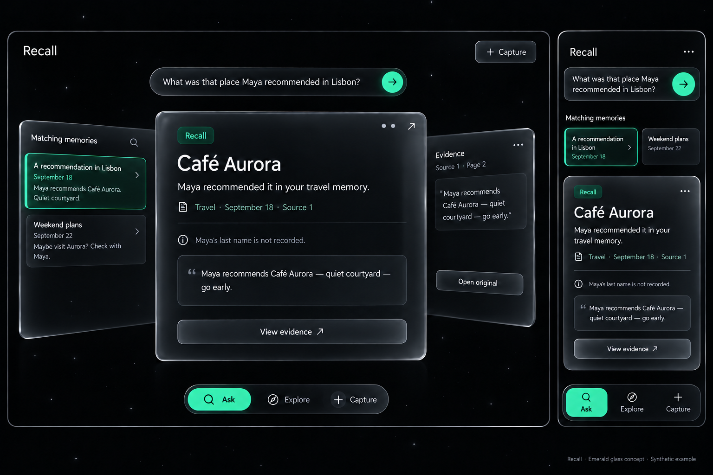

# Recall glass-board design exploration

October 6–7, 2026. All depicted memories, people, notes and source images are synthetic. Generated mockups illustrate design intent; they are not screenshots of working features or provider-quality evidence. Product authority remains [PRD](../../PRD.md), behavior remains [UX-SPEC](../../UX-SPEC.md), and acceptance remains [V1-STATUS](../../V1-STATUS.md).

## Current direction

Digital glass boards on a deep space-black canvas. The defining experience is recovering a source-backed detail from a vague recollection. The user approved glass boards and the black background, then requested an interactive layout that adapts to Ask, Explore, Capture and evidence inspection. Paper textures and handwritten scraps were rejected as the main interface; original images appear only on explicit source access.

The working web client implements blue accents. Emerald is the latest palette preview, not yet an implemented or finally accepted palette. No app deployment occurred in this design packet.

## Concept progression

| Concept | Outcome |
| --- | --- |
| [01 Evidence first](01-evidence-first.png) | Correct product mechanism; felt too traditional |
| [02 Memory canvas](02-memory-canvas.png) | Explored spatial interaction; paper-note appearance rejected |
| [03 Digital](03-digital.png) | Fully digital direction preferred |
| [04 Glass](04-glass.png) | Glass-board material approved; colored atmosphere replaced |
| [05 Space black](05-space-black.png) | Approved visual direction used for implementation |
| [06 Emerald](06-emerald.png) | Latest palette exploration; production CSS remains blue |
| [07 Working UI](07-working-ui.png) | Actual browser screenshot with a clearly labeled synthetic fixture |

## Palette options

| Direction | Main green | Softer accent | Intended character |
| --- | --- | --- | --- |
| Emerald | `#35D99A` | `#A7F3D0` | Vivid, modern, precise; recommended exploration |
| Jade | `#70CDB0` | `#C0EBDD` | Softer and calm |
| Fern | `#82C878` | `#D0EBC5` | Organic and distinctive |

Emerald preview uses near-black `#030806`, neutral smoked glass and silver rims. Bright green actions use dark `#052012` text/icons. Green belongs in selected states, active controls and restrained reflections. Uncertainty retains its own text and amber treatment. A generated image does not establish exact token values or accessibility compliance.

## Try the interactive implementation locally

From the repository root, with dependencies already installed:

```powershell
npm run dev --workspace @recall/web -- --host 127.0.0.1
```

Open `http://127.0.0.1:5173/dev/preview.html`. The development-only fixture imports the real App and CSS with synthetic services. It makes no production API or provider calls, sends no email, and refuses uploads. Try: **What was that place Maya recommended in Lisbon?** Other questions return an explicit preview limitation. The normal production Vite entry does not bundle this fixture.

Ask reveals supporting-source, answer and evidence boards. Focus answer hides the source list; Show sources restores it. Opening an original verifies synthetic bytes. Explore and Capture switch the layout. Real capture persistence and authorization are verified separately by tests and live acceptance gates.

## Boundaries

No graph UI, autonomous actions, real memory corpus, live provider evaluation or offline generative answers were added. Native clients and backend contracts remain unchanged. See [web DESIGN](../../../apps/web/DESIGN.md) for the implemented visual rules and [V1-STATUS](../../V1-STATUS.md) for commands and exact verification boundaries.


